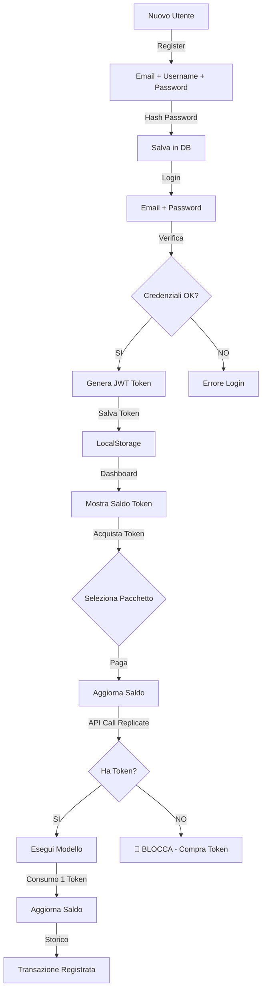

# 🪙 Sistema di Pagamenti via Token - Guida Completa

## 📋 Panoramica

Questo progetto implementa un **sistema di pagamenti via token** per il wrapper Replicate.ai con le seguenti funzionalità:

✅ **Utenti registrati** - Sistema di autenticazione con JWT
✅ **Acquisto crediti** - Pacchetti token preconfigurati
✅ **Consumo token** - Ogni chiamata a Replicate consuma token
✅ **Blocco accesso** - Se token = 0 → API bloccata

---

## 🏗️ Architettura

### Backend (FastAPI)

```
app/
├── main.py                 # Entry point FastAPI
├── database.py             # Setup database SQLAlchemy
├── schemas.py              # Modelli Pydantic
├── security.py             # Autenticazione JWT + hashing password
├── services.py             # Logica di business utenti/token
├── replicate_wrapper.py    # Wrapper Replicate con controllo token
├── auth_routes.py          # Endpoint autenticazione
└── token_routes.py         # Endpoint sistema token
```

### Frontend (Angular)

```
src/app/
├── services/
│   └── auth.service.ts     # Comunicazione API + gestione stato
├── pages/
│   ├── login/              # Pagina login
│   ├── register/           # Pagina registrazione
│   ├── dashboard/          # Dashboard profilo + saldo
│   ├── store/              # Negozio acquisto token
│   └── transactions/       # Storico transazioni
└── app.routes.ts           # Routing Angular
```

---

## 🚀 Installation & Setup

### Backend Setup

1. **Installa dipendenze:**
```bash
cd backend
pip install -r requirements.txt
```

2. **Configura variabili d'ambiente** (crea `.env`):
```env
REPLICATE_API_TOKEN=your_replicate_token_here
SECRET_KEY=your_secret_key_for_jwt
DATABASE_URL=sqlite:///./repli.db
```

3. **Avvia il server:**
```bash
python run.py
# oppure con uvicorn
uvicorn app.main:app --reload --port 8000
```

### Frontend Setup

1. **Installa dipendenze:**
```bash
cd frontend
npm install
```

2. **Avvia dev server:**
```bash
ng serve
# oppure npm start
```

Accedi a `http://localhost:4200`

---

## 📡 API Endpoints

### Autenticazione

| Endpoint | Metodo | Descrizione |
|----------|--------|-------------|
| `/api/auth/register` | POST | Registra nuovo utente |
| `/api/auth/login` | POST | Autentica utente |
| `/api/auth/profile` | GET | Profilo utente corrente |
| `/api/auth/balance` | GET | Saldo token |
| `/api/auth/transactions` | GET | Storico transazioni |

### Token

| Endpoint | Metodo | Descrizione |
|----------|--------|-------------|
| `/api/tokens/packages` | GET | Elenco pacchetti token |
| `/api/tokens/purchase` | POST | Acquista token |
| `/api/tokens/check` | GET | Verifica saldo disponibile |

---

## 💳 Flusso di Pagamento

### 1. Registrazione Utente
```
User → Register Form → Backend → Database
      (email, username, password)
```

### 2. Login
```
User → Login Form → JWT Token Created → Stored in LocalStorage
```

### 3. Acquisto Token
```
User → Select Package → Payment Gateway (simulato)
    → Purchase Request → Backend deducts from DB
    → Update User Balance → Frontend refreshes
```

### 4. Consumo Token per API Call
```
User → Call Replicate API → Check user balance
    → If balance > 0 → Execute → Deduct 1 token
    → If balance = 0 → BLOCKED ❌
```

---

## 🔑 Token Predefiniti (Pacchetti)

| Pacchetto | Token | Prezzo | €/Token |
|-----------|-------|--------|---------|
| Starter | 100 | €1.00 | €0.01 |
| Growth | 500 | €4.50 | €0.009 |
| Pro | 1000 | €8.00 | €0.008 |
| Enterprise | 5000 | €35.00 | €0.007 |

**Prezzo base:** €0.01 per token

---

## 🗄️ Database Schema

### Tabella `users`
```sql
id (PK)
email (UNIQUE)
username (UNIQUE)
hashed_password
tokens (FLOAT) -- Saldo token
is_active (BOOL)
created_at (DATETIME)
```

### Tabella `token_transactions`
```sql
id (PK)
user_id (FK)
amount (FLOAT) -- +/- valore
transaction_type (STRING) -- 'purchase' o 'consume'
description (STRING)
created_at (DATETIME)
```

---

## 🔐 Sicurezza

### Password
- ✅ Hashing con **bcrypt**
- ✅ Salt generato automaticamente
- ✅ Nessuna plain-text nel database

### Autenticazione
- ✅ JWT (JSON Web Tokens)
- ✅ Token memorizzato in localStorage
- ✅ Validazione su ogni richiesta API

### CORS
- ✅ Configurato per `http://localhost:4200` (sviluppo)
- ✅ In produzione: aggiornare gli origin autorizzati

---

## 📊 Workflow Completo



---

## 🛠️ Customizzazione

### Cambiare il prezzo dei token

Modifica in `backend/app/security.py`:
```python
TOKEN_PRICE_MULTIPLIER = 0.01  # Cambia questo valore (€ per token)
```

### Cambiare il costo per API call

Modifica in `backend/app/replicate_wrapper.py`:
```python
TOKEN_COST_PER_CALL = 1.0  # Cambia questo valore
```

### Cambiare i pacchetti disponibili

Modifica in `backend/app/token_routes.py` nella funzione `get_packages()`:
```python
packages = [
    {"id": 1, "name": "Custom", "tokens": 500, "price": 3.00, ...},
    # Aggiungi altri pacchetti...
]
```

---

## 🐛 Troubleshooting

### "Token non autorizzato"
```
Soluzione: Verifica che il JWT token nel LocalStorage sia valido
          Prova a fare logout e login di nuovo
```

### "Token insufficienti"
```
Soluzione: Vai al negozio (Store) e acquista token
          Ricaricare la pagina per vedere il saldo aggiornato
```

### CORS Error
```
Soluzione: Assicurati che il backend sia in esecuzione su localhost:8000
          Verifica che l'URL nel frontend sia corretto
```

### Database Error
```
Soluzione: Elimina il file repli.db e riavvia il backend
          Assicurati di avere i permessi di scrittura nella cartella
```

---

## 📈 Prossimi Passi (Miglioramenti)

- [ ] Integrazione Stripe/PayPal per pagamenti reali
- [ ] Email verification al signup
- [ ] Recupero password
- [ ] Multi-linguaggio (i18n)
- [ ] Rate limiting per API calls
- [ ] Referral system per token bonus
- [ ] Admin dashboard per gestione utenti
- [ ] Analytics e statistiche dettagliate
- [ ] Webhook per notifiche transazioni
- [ ] Mobile app (React Native/Flutter)

---

## 📞 Support

Per domande o problemi:
1. Controlla il console del browser (F12)
2. Controlla i log del backend
3. Verifica che le dipendenze siano installate correttamente
4. Assicurati che le porte non siano occupate:
   - Backend: 8000
   - Frontend: 4200

---

## 📝 Licenza

MIT License - Usa liberamente per progetti personali e commerciali.

---

**Versione:** 0.1.0  
**Data:** Febbraio 2026  
**Autore:** Sistema Token Replicate
